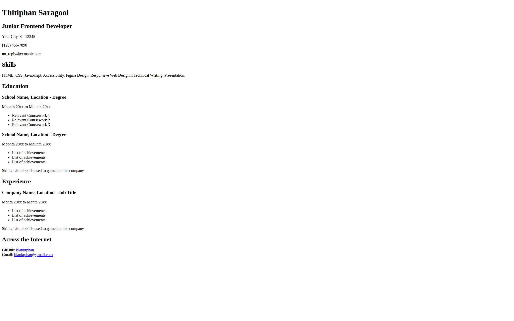

# Project: Single-Page CV

## 🎯 The Challenge form [Roadmap](https://roadmap.sh/)

Create a single-page HTML CV to showcase your career history.

> The goal of this project is to teach you how to create a structured, single-page CV using only HTML. You will focus on laying out your education, skills, and career history in a clean, semantic manner. Styling will be addressed in a later project.

In this project, you are required to create a single-page CV (Curriculum Vitae) using only HTML. Your webpage should look like the following image:


Key requirements for this project:

* Semantic HTML: Use appropriate HTML tags to structure your CV.
* SEO Meta Tags: Include essential meta tags for SEO.
* Open Graph (OG) Tags: Add OG tags for better social media sharing.
* Favicon: Add a favicon for your CV page.

The structure of your CV should be easily understandable and ready for styling in a future project.

Submission Checklist:
* Semantically correct HTML structure.
* Single-page layout with sections for education, skills, and career history.
* SEO meta tags in the head section.
* OG tags for better social media sharing.
* A favicon linked in the head section.

---

By completing this project, you'll gain a solid understanding of how to create a single-page CV using HTML, apply basic SEO principles, and prepare your webpage for future styling. This foundation will enable you to move on to styling the CV using CSS in subsequent projects.

---

## 💡 **My solution**



You can vote on the solution to this problem at the [link](https://roadmap.sh/projects/single-page-cv/solutions?u=683bb642d3156c8eaf44200b)

---

## 🔍 Code Explanation (Generate by GitHub Copilot)

### 📋 Project Overview
This is a **Single-Page CV project** that demonstrates creating a structured HTML curriculum vitae without any CSS styling. The project focuses on semantic HTML structure, SEO optimization, and social media integration.

### 🏗️ Code Structure Analysis

#### 📑 Document Head Section
```html
<!-- Meta data configuration tags -->
<meta http-equiv="X-UA-Compatible" content="IE=edge">
<meta charset="UTF-8">
<meta name="viewport" content="width=device-width, initial-scale=1.0">
```
**Purpose:** Essential meta tags for browser compatibility, character encoding, and responsive design foundation.

#### 🔍 SEO Optimization
```html
<meta name="description" content="Thitiphan Saragool - Junior Frontend Developer from Bangkok, Thailand...">
<meta name="keywords" content="Frontend Developer, HTML, CSS, JavaScript, Web Developer, Bangkok, Thailand">
<meta name="author" content="Thitiphan Saragool">
<meta name="robots" content="index, follow">
```
**Purpose:** Improves search engine visibility and ranking through descriptive metadata and proper indexing instructions.

#### 📱 Social Media Integration
```html
<!-- Open Graph meta tags for social media link previews -->
<meta property="og:title" content="Thitiphan Saragool - Junior Frontend Developer">
<meta property="og:description" content="Junior Frontend Developer from Bangkok, Thailand...">
<meta property="og:type" content="profile">
<meta property="og:site_name" content="Thitiphan Saragool CV">

<!-- Twitter card meta tags for Twitter link previews -->
<meta name="twitter:card" content="summary">
<meta name="twitter:title" content="Thitiphan Saragool - Junior Frontend Developer">
<meta name="twitter:description" content="Junior Frontend Developer from Bangkok, Thailand...">
```
**Purpose:** Enables rich previews when shared on social media platforms like Facebook, LinkedIn, and Twitter.

#### 🌐 Semantic HTML Structure
```html
<main>
    <header>
        <h1>Thitiphan Saragool</h1>
        <h2>Junior Frontend Developer</h2>
        <!-- Contact information -->
    </header>
    
    <section>
        <h2>Skills</h2>
        <!-- Skills content -->
    </section>
    
    <section>
        <h2>Education</h2>
        <article>
            <!-- Individual education entries -->
        </article>
    </section>
    
    <section>
        <h2>Experience</h2>
        <article>
            <!-- Individual work experience entries -->
        </article>
    </section>
    
    <section>
        <h2>Across the Internet</h2>
        <address>
            <!-- Contact and social media links -->
        </address>
    </section>
</main>
```
**Purpose:** Uses proper semantic elements for better accessibility, SEO, and code maintainability.

### 🎨 Key Features Implementation

#### 1. **Header Section** 👤
```html
<header>
    <h1>Thitiphan Saragool</h1>
    <h2>Junior Frontend Developer</h2>
    <p>Your City, ST 12345</p>
    <p>(123) 456-7890</p>
    <p>no_reply@exmaple.com</p>
</header>
```
- Uses `<header>` for semantic structure
- Proper heading hierarchy (h1 for name, h2 for title)
- Contact information in paragraph elements

#### 2. **Skills Section** 💪
```html
<section>
    <h2>Skills</h2>
    <p>HTML, CSS, JavaScript, Accessibility, Figma Design, Responsive Web Design, Technical Writing, Presentation.</p>
</section>
```
- Organized as a dedicated section
- Skills listed in a readable format
- Ready for future CSS styling enhancements

#### 3. **Education & Experience Sections** 🎓💼
```html
<section>
    <h2>Education</h2>
    <article>
        <h3>School Name, Location - Degree</h3>
        <p>Month 20xx to Month 20xx</p>
        <ul>
            <li>Relevant Coursework 1</li>
            <li>Relevant Coursework 2</li>
            <li>Relevant Coursework 3</li>
        </ul>
    </article>
</section>
```
- Uses `<article>` for individual entries
- Consistent structure for easy styling
- Lists for achievements and coursework

#### 4. **Contact Section** 🌍
```html
<section>
    <h2>Across the Internet</h2>
    <address>
        <p>GitHub: <a href="https://github.com/blanktphan" rel="noopener noreferrer" target="_blank">blanktphan</a></p>
        <p>Email: <a href="mailto:blanktphan@gmail.com">blanktphan@gmail.com</a></p>
    </address>
</section>
```
- Uses semantic `<address>` element
- Security attributes (`rel="noopener noreferrer"`) for external links
- Proper mailto links for email

### 🔧 Technical Implementation Details

#### Favicon Implementation
```html
<link rel="apple-touch-icon" sizes="180x180" href="./favicon_io/apple-touch-icon.png">
<link rel="icon" type="image/png" sizes="32x32" href="./favicon_io/favicon-32x32.png">
<link rel="icon" type="image/png" sizes="16x16" href="./favicon_io/favicon-16x16.png">
<link rel="manifest" href="./favicon_io/site.webmanifest">
```
**Purpose:** Provides brand identity across different devices and platforms with multiple icon sizes.

#### Security Best Practices
```html
<a href="https://github.com/blanktphan" rel="noopener noreferrer" target="_blank">
```
**Purpose:** `rel="noopener noreferrer"` prevents security vulnerabilities and performance issues when opening external links.

### 📊 Project Benefits

1. **SEO-Ready Structure** - Optimized for search engine crawling and indexing
2. **Social Media Friendly** - Rich previews on sharing platforms
3. **Accessibility Compliant** - Screen reader compatible with semantic HTML
4. **Mobile Responsive Foundation** - Viewport meta tag for device adaptation
5. **Future-Proof Architecture** - Clean structure ready for CSS styling
6. **Performance Optimized** - Minimal HTML with proper resource loading

### 🎓 Learning Outcomes

This project demonstrates:
- **Semantic HTML fundamentals** and proper element usage
- **SEO best practices** for web visibility
- **Social media optimization** techniques
- **Web accessibility principles** implementation
- **Professional web development structure** and organization
- **Security considerations** for external links
  
---

### 🙏 **Thank You [Roadmap.sh](https://roadmap.sh/)**

I'm incredibly grateful to [**Roadmap.sh**](https://roadmap.sh/) for their **excellent learning roadmaps**, **clear learning structures**, and **valuable project collection**. These resources have *significantly contributed* to developing my **skills** and **understanding** across various **career paths**. The **knowledge and experience** gained from [Roadmap.sh](https://roadmap.sh/) form a **crucial foundation** for the projects I've created.