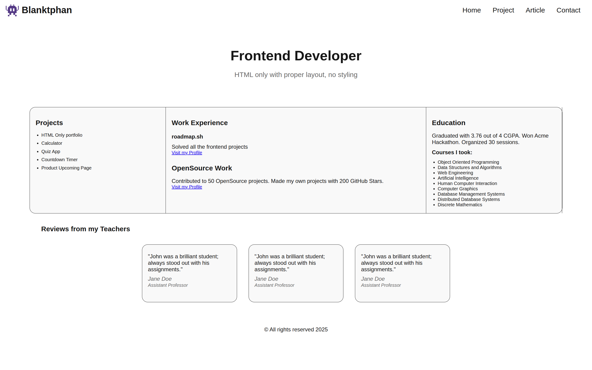
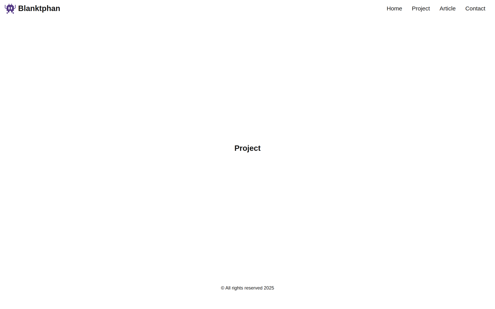

# 👨‍💻 Project: Basic HTML Website

## 🎯 The Challenge from [Roadmap](https://roadmap.sh/)

Create simple HTML only website with multiple pages.

> Goal of this project is to teach you how to structure a website using HTML i.e. different sections of a website like header, footer, navigation, main content, sidebars etc. Do not style the website, only focus on the structure. Styling will be done in separate projects.

In this project, you are required to create a simple HTML only website with multiple pages. The website should have following pages:

* Homepage
* Projects
* Articles
* Contact
  
The website should have a navigation bar that should be present on all pages and link to all the pages.

You are not required to style the website, you are only required to create the structure of the website using HTML. Goals of this project are:

* Learn how to create multiple pages in a website.
* Structure a website using HTML in a semantic way.
* Structure in a way that you can easily add styles later.
* Add SEO meta tags to the website.
  
You can use the following mockup example to create the structure of the website (remember, you are not required to style the website, only focus on the structure that you can style later):


Again, make sure that your submission includes the following:

* Semantically correct HTML structure.
* Multiple pages with a navigation bar.
* SEO meta tags in the head of each page.
* Contact page should have a form with fields like name, email, message etc.

---

After completing this project, you will have a good understanding of how to structure a website using HTML, basic SEO meta tags, HTML tags, forms etc. You can now move on to the next project where you will learn how to style this website using CSS.

---

## 💡 **My solution**





You can vote on the solution to this problem at the [link](https://roadmap.sh/projects/basic-html-website/solutions?u=683bb642d3156c8eaf44200b).

---

## 🔍 Code Explanation (Generate by GitHub Copilot)

### 📋 Project Overview
This is a **Basic HTML Website project** from [Roadmap.sh](https://roadmap.sh/) that demonstrates creating a multi-page website using semantic HTML structure. The project focuses on proper HTML organization, SEO optimization, navigation systems, and form implementation without any CSS styling.

### 🎯 Project Requirements
- ✅ Semantically correct HTML structure
- ✅ Multiple pages with consistent navigation
- ✅ SEO meta tags on all pages
- ✅ Contact form with proper input fields
- ✅ Accessible and future-ready code structure

### 🏗️ File Structure Analysis

```
02-basic-html-website/
├── index.html          # Homepage with hero section and content overview
├── project.html        # Projects showcase page
├── article.html        # Articles and blog content page
├── contact.html        # Contact form and information page
├── style.css           # Basic styling for layout structure
├── favicon_io/         # Favicon assets for branding
│   ├── apple-touch-icon.png
│   ├── favicon-32x32.png
│   ├── favicon-16x16.png
│   └── site.webmanifest
└── image/             # Project screenshots and mockups
```

### 📑 HTML Structure Analysis

#### Common Header Structure (All Pages)
```html
<header>
    <nav aria-label="Main navigation">
        <div class="logo">
            
            <a href="./index.html">Blanktphan</a>
        </div>
        <ul role="menubar">
            <li role="none"><a href="./index.html" role="menuitem">Home</a></li>
            <li role="none"><a href="./project.html" role="menuitem">Project</a></li>
            <li role="none"><a href="./article.html" role="menuitem">Article</a></li>
            <li role="none"><a href="./contact.html" role="menuitem">Contact</a></li>
        </ul>
    </nav>
</header>
```
**Purpose:** Consistent navigation across all pages with accessibility features and semantic structure.

#### SEO Meta Tags Implementation
```html
<!-- Meta data configuration tags -->
<meta charset="UTF-8">
<meta http-equiv="X-UA-Compatible" content="IE=edge">
<meta name="viewport" content="width=device-width, initial-scale=1.0">
<meta name="description" content="Page-specific description for SEO">
<meta name="keywords" content="Relevant keywords for search engines">
<meta name="author" content="Thitiphan Saragool">
<meta name="robots" content="index, follow">

<!-- Open Graph meta tags for social media -->
<meta property="og:title" content="Page Title">
<meta property="og:description" content="Page description for social sharing">
<meta property="og:type" content="website">
<meta property="og:site_name" content="Thitiphan Saragool Portfolio">

<!-- Twitter card meta tags -->
<meta name="twitter:card" content="summary">
<meta name="twitter:title" content="Page Title">
<meta name="twitter:description" content="Page description for Twitter">
```
**Purpose:** Comprehensive SEO optimization and social media integration for better discoverability.

### 🏠 Page-Specific Implementation

#### 1. **Homepage (index.html)** 🏡
```html
<main>
    <!-- Hero section -->
    <section class="hero" aria-labelledby="hero-heading">
        <h1 id="hero-heading">Frontend Developer</h1>
        <p>HTML only with proper layout, no styling</p>
    </section>
    
    <!-- Main content sections -->
    <div class="main-content">
        <section aria-labelledby="projects-heading">
            <h2 id="projects-heading">Projects</h2>
            <ul class="projects">
                <li>HTML Only portfolio</li>
                <li>Calculator</li>
                <!-- More projects -->
            </ul>
        </section>
        
        <!-- Work experience and education sections -->
    </div>
    
    <!-- Testimonials section -->
    <section class="testimonials" aria-labelledby="testimonials-heading">
        <!-- Review articles with blockquote and cite elements -->
    </section>
</main>
```

**Key Features:**
- **Hero section** with main professional heading
- **Projects showcase** using semantic lists
- **Work experience** organized in articles
- **Testimonials** with proper quote markup
- **Responsive grid layout** ready for CSS styling

#### 2. **Contact Page (contact.html)** 📞
```html
<main class="contact-page">
    <!-- Contact form section -->
    <section class="contact-form-section">
        <h2>Send a Message</h2>
        <form action="#" method="post" class="contact-form">
            <div class="form-group">
                <label for="name">Full Name *</label>
                <input type="text" id="name" name="name" required>
            </div>
            <div class="form-group">
                <label for="email">Email Address *</label>
                <input type="email" id="email" name="email" required>
            </div>
            <div class="form-group">
                <label for="subject">Subject *</label>
                <input type="text" id="subject" name="subject" required>
            </div>
            <div class="form-group">
                <label for="message">Message *</label>
                <textarea id="message" name="message" rows="6" required></textarea>
            </div>
            <div class="form-group">
                <button type="submit" class="submit-btn">Send Message</button>
            </div>
        </form>
    </section>
    
    <!-- Contact information -->
    <section class="contact-info">
        <div class="info-grid">
            <div class="info-item">
                <h3>Email</h3>
                <p><a href="mailto:blanktphan@gmail.com">blanktphan@gmail.com</a></p>
            </div>
            <!-- Phone and location info -->
        </div>
    </section>
</main>
```

**Form Features:**
- **Proper form validation** with required fields
- **Semantic form structure** with labels and fieldsets
- **Accessibility compliant** with proper ARIA attributes
- **Multiple input types** (text, email, textarea)
- **Contact information grid** for additional contact methods

### 🎨 CSS Structure (style.css)

#### Layout System
```css
/* Flexbox navigation system */
nav {
    display: inline-flex;
    justify-content: space-between;
    width: 100%;
    height: 100%;
}

/* Hero section centering */
main .hero {
    display: flex;
    flex-direction: column;
    align-items: center;
    justify-content: center;
    text-align: center;
}

/* Content grid system */
main .main-content {
    display: inline-flex;
    flex-direction: row;
    border: 1px solid hsla(0, 0%, 9%, 1);
}
```

#### Responsive Contact Form
```css
.contact-page {
    max-width: 800px;
    margin: 0 auto;
    padding: 40px 20px;
}

.contact-form input,
.contact-form textarea {
    width: 100%;
    padding: 12px 15px;
    border: 1px solid hsla(0, 0%, 80%, 1);
    border-radius: 5px;
}
```

### 🔧 Technical Implementation Details

#### Accessibility Features
- **ARIA labels** and `aria-labelledby` for screen readers
- **Semantic HTML5 elements** (`<nav>`, `<main>`, `<section>`, `<article>`)
- **Proper heading hierarchy** (h1 → h2 → h3)
- **Form accessibility** with labels and proper input types
- **Keyboard navigation support** with proper focus management

#### Security Best Practices
```html
<a href="https://github.com/blanktphan" rel="noopener noreferrer" target="_blank">
```
- **`rel="noopener noreferrer"`** prevents security vulnerabilities
- **Form validation** with required attributes
- **Proper input types** for email validation

#### Performance Optimization
- **Semantic HTML structure** for faster parsing
- **Optimized favicon sizes** for different devices
- **Minimal CSS** focused on layout structure
- **Progressive enhancement** ready architecture

### 📊 Project Benefits

1. **Multi-page Architecture** - Professional website structure
2. **SEO Optimization** - Search engine friendly markup
3. **Accessibility Compliance** - WCAG guidelines implementation
4. **Mobile-Ready Foundation** - Responsive design preparation
5. **Maintainable Code** - Clean, semantic HTML structure
6. **Form Functionality** - Complete contact system
7. **Social Media Integration** - Open Graph and Twitter cards
8. **Performance Focused** - Lightweight, efficient code

### 🎓 Learning Outcomes

This project demonstrates:
- **Multi-page website architecture** and navigation systems
- **Semantic HTML fundamentals** and proper element usage
- **Form creation and validation** with accessibility features
- **SEO optimization techniques** for web visibility
- **Project organization** and file structure management
- **CSS layout systems** preparation for future styling
- **Web accessibility principles** implementation
- **Professional development practices** and code organization

---

### 🙏 **Thank You [Roadmap.sh](https://roadmap.sh/)**

I'm incredibly grateful to [**Roadmap.sh**](https://roadmap.sh/) for their **excellent learning roadmaps**, **clear learning structures**, and **valuable project collection**. These resources have *significantly contributed* to developing my **skills** and **understanding** across various **career paths**. The **knowledge and experience** gained from [Roadmap.sh](https://roadmap.sh/) form a **crucial foundation** for the projects I've created.